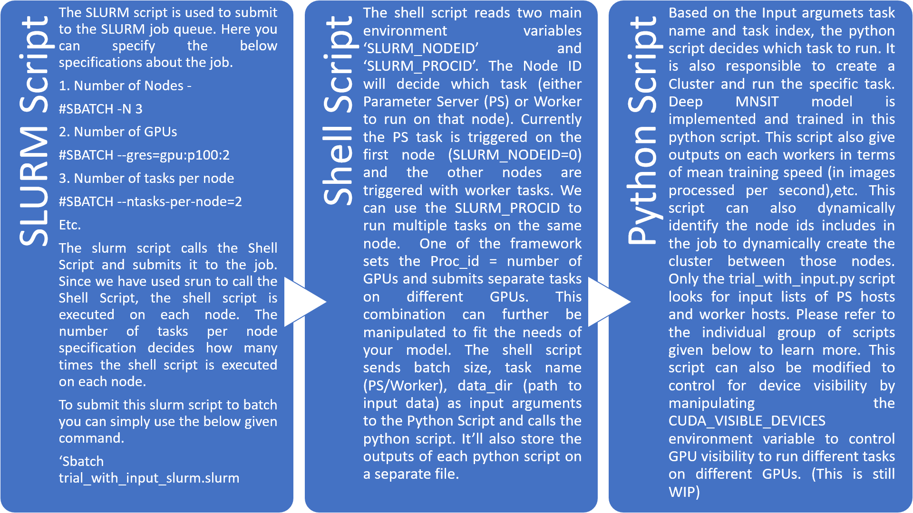

### Distributed Tensorflow 

This directory includes code that implements Distributed Tensorflow where we can employ more than one nodes (machines) to distribute a deep neural network. This code is modified from Tensorflow tutorials for Distributed Tensorflow at ( https://github.com/tensorflow/tensorflow/blob/master/tensorflow/tools/dist_test/python/mnist_replica.py ) to suite a computer cluster (HPC) platforms like the Bridges system at Pittsburgh Supercomputing Center. This directory is still a Work In Progress.

The code currently has to be submitted as a batch job to SLURM. The overall workflow is as shown below.

  

Below is a brief description of the workflow:

SLURM Script: 
The SLURM script is used to submit to the SLURM job queue. Here you can specify the below specifications about the job. 
1. Number of Nodes - 
#SBATCH -N 3
2. Number of GPUs
#SBATCH --gres=gpu:p100:2
3. Number of tasks per node
#SBATCH --ntasks-per-node=2
Etc.
The slurm script calls the Shell Script and submits it to the job. Since we have used srun to call the Shell Script, the shell script is executed on each node. The number of tasks per node specification decides how many times the shell script is executed on each node.
To submit this slurm script to batch you can simply use the below given command.
‘Sbatch trial_with_input_slurm.slurm

Shell Script:
The shell script reads two main environment variables ‘SLURM_NODEID’ and ‘SLURM_PROCID’. The Node ID will decide which task (either Parameter Server (PS) or Worker to run on that node). Currently the PS task is triggered on the first node (SLURM_NODEID=0) and the other nodes are triggered with worker tasks. We can use the SLURM_PROCID to run multiple tasks on the same node.  One of the framework sets the Proc_id = number of GPUs and submits separate tasks on different GPUs. This combination can further be manipulated to fit the needs of  your model. The shell script sends batch size, task name (PS/Worker), data_dir (path to input data) as input arguments to the Python Script and calls the python script. It’ll also store the outputs of each python script on a separate file.

Python Script:
Based on the Input argumets task name and task index, the python script decides which task to run. It is also responsible to create a Cluster and run the specific task. Deep MNSIT model is implemented and trained in this python script. This script also give outputs on each workers in terms of mean training speed (in images processed per second),etc. This script can also dynamically identify the node ids includes in the job to dynamically create the cluster between those nodes. Only the trial_with_input.py script looks for input lists of PS hosts and worker hosts. Please refer to the individual group of scripts given below to learn more. This script can also be modified to control for device visibility by manipulating the CUDA_VISIBLE_DEVICES environment variable to control GPU visibility to run different tasks on different GPUs. (This is still WIP)

There are three different combinations that implement different ways to Distribute the Deep MNIST model. They are briefly described as follows.

**1. Single GPU Per Node:**

Scripts:  

a. 1GPU_per_node_dist_tf_benchmark.slurm

b. shell_Deep_Mnist_1GPU_Per_Node.sh

c. Deep_Mnist_1GPU_Per_Node.py

These scripts will execute the distribtued tensorflow with 1 GPU per node. By default the 1st node is selected as Parameter Server. These scripts create clusters dynamically based on the nodelist provided by job environment variables. These scripts work but need further fine tuning in terms of repeatability. The added benefit is that the node list doesn't have to provided as an input.

**2. Multi GPUs Per Node:**

Scripts:

a. trial_with_input_slurm.slurm

b. trial_with_input_shell.sh

c. trial_with_input.py

These scripts will execute the distribtued tensorflow with multiple GPUs per node. By default the 1st node is selected as Parameter Server. These scripts do not create clusters dynamically. Hence the shell script is responsible for specifying the cluster by giving ps_hosts list and worker_hosts list as input to the python script. The script also controls GPU visibility according to the Task Index by manipulating the environment variable named 'CUDA_VISIBLE_DEVICES'. These scripts are still WIP. The idea is that each node will run servers equal to the number of GPUs on different ports. And we can achieve that by setting the GPU visibility.

**3. Multi GPUs Per Node:**

Scripts:

a. dist_tf_benchmark.slurm

b. multi_node_seperation.sh

c. distributed_deep_mnist.py

These scripts will execute the distribtued tensorflow with multiple GPUs per node. By default the 1st node is selected as Parameter Server. These scripts create clusters dynamically. Based on the number of GPUs the device specification is given input with device repica setter module of tensorflow where we can specify the task name, task index and GPUs. The basic idea is that each node will run only one server on a dedicated port and the device replica setter will take care of creating model replicas on all the GPUs. This way all the available GPUs will be employed. These scripts are still WIP.

Future: https://github.com/tensorflow/models/tree/master/research/slim
Slim is a High-Level API which can help us in achieving distributed tensorflow with Multiple Nodes and Multiple GPUs on each node. Needs further investigation and experimentation around this area.

Authored By,
Anand Sakhare
Pittsburgh Supercomputing Center | Carnegie Mellon University
Email ID: asakhare@andrew.cmu.edu
